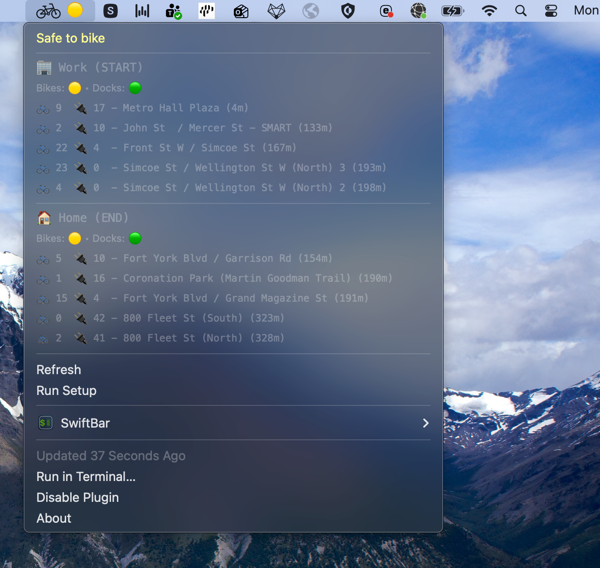

# Toronto Bike Share TUI 🚲

> **Stop tapping. Start riding.**

A zero-latency, CLI-based dashboard for Toronto Bike Share commuters. Designed to solve the "death by a thousand cuts" friction of using the official mobile app for daily commutes.

### Watch the Demo

[Click here to watch the demo 📺](https://youtu.be/vKsHNcFMIC0)

*Click the link above to watch a working demo of the app in action.*


### Setup Wizard Demo


## Menu Bar App (macOS)

You can put the dashboard right in your menu bar using **SwiftBar**.


1.  **Install SwiftBar:** [Download from GitHub](https://github.com/swiftbar/SwiftBar/releases)
2.  **Run the Installer:**
    ```bash
    ./scripts/install_swiftbar.sh
    ```
    
This creates a plugin that runs `bikes --swiftbar` every minute. You'll see a bicycle icon (🟢/🟡/🔴) indicating the status of your commute.

### Preview



## How It Works

### 1. Real-Time Data
Fetches live JSON feeds from the GBFS (General Bikeshare Feed Specification) API:
- `station_information.json` (Location, capacity)
- `station_status.json` (Current bikes/docks)

### 2. Predictive Engine
We processed **9 months of historical ridership data (Jan-Sep 2024)** containing **5.3 million trips**.
- We calculated the **Net Flow** (Arrivals - Departures) for every station, for every hour of the week.
- This creates a "velocity" vector: Is this station gaining or losing bikes right now?

### 3. Trend-Adjusted Predictions
The "High/Medium/Low" likelihood isn't just a guess. It combines:
- **Current State:** How many bikes are there right now?
- **Historical Velocity:** How fast do they usually leave at this hour?

| Likelihood | Logic |
|------------|-------|
| **HIGH**   | Station has bikes AND historical trend is stable/increasing. |
| **MEDIUM** | Station has bikes BUT historically empties fast at this time. |
| **LOW**    | Station is empty OR critically low and trending downwards. |

## Customization

The easiest way to customize your locations is to run the setup wizard:

```bash
bikes --setup
```

This saves your settings to `~/.bikes_config.json`. You can edit this file directly if you want to tweak coordinates manually.

```json
{
    "Home": {
        "lat": 43.6375,
        "lon": -79.4030,
        "emoji": "🏠",
        "address": "215 Fort York Boulevard"
    },
    "Work": {
        "lat": 43.6458,
        "lon": -79.3854,
        "emoji": "🏢",
        "address": "155 Wellington Street West"
    }
}
```

## Documentation

Detailed design documentation for each feature:

| Document | Description |
|----------|-------------|
| [Engineering Learnings](docs/Learnings.md) | **Start Here:** Imperative vs Declarative, Terminal Illusion, and Architecture |
| [Case Study](docs/Case_Study.md) | The full product case study: problem, audit, solution, and learnings |
| [Prediction Model Design](docs/Prediction_Model_Design.md) | Why simple statistics beat ML for this problem |
| [Trip Summary Feature](docs/Trip_Summary_Feature.md) | Complete design rationale for the trip confidence calculation |
| [Setup Wizard Feature](docs/Setup_Wizard_Feature.md) | Geocoding decisions, UX flow, and the "800m error" story |
| [Menu Bar Feature](docs/MenuBar_Feature.md) | Design of the SwiftBar integration and "Traffic Light" UI |
| [FAQ & Key Decisions](docs/FAQ_and_Key_Decisions.md) | Quick answers to common questions about the design |

## License
MIT License. Data provided by Toronto Open Data.
