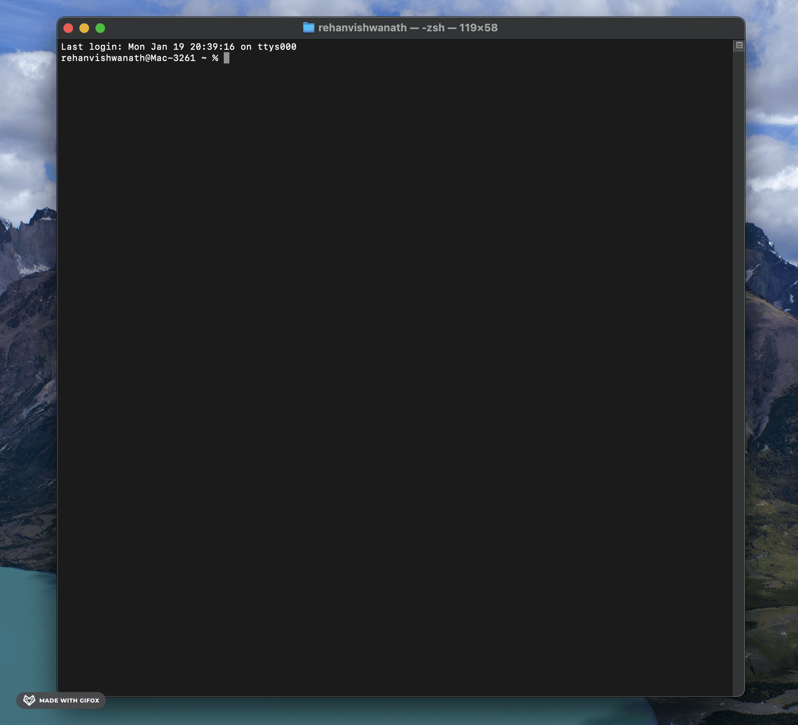
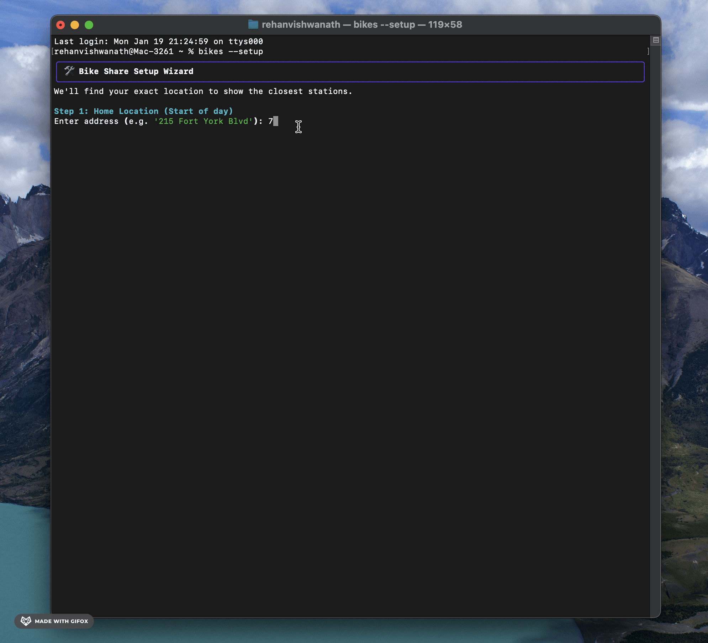
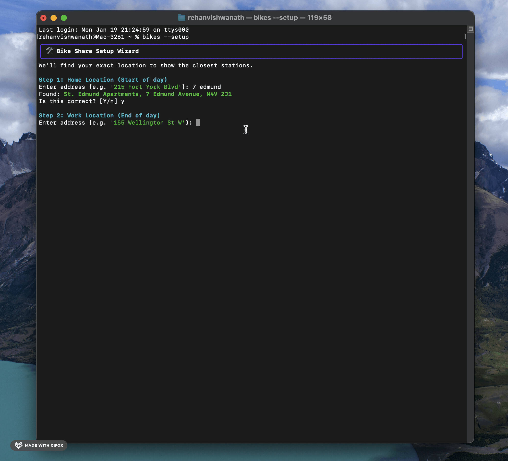
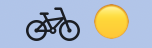

# Toronto Bike Share TUI and Mac Menubar App 🚲

> **Stop tapping. Start riding.**

A zero-latency, real-time, CLI-based dashboard, Mac Menubar App and iOS Widget for Toronto Bike Share commuters. Designed to solve the "death by a thousand cuts" friction of using the official mobile app for daily commutes.

### Watch the Demo




## Table of Contents
- [The Problem](#the-problem)
- [The Solution](#the-solution)
- [Key Features](#key-features)
- [Installation](#installation)
- [How It Works](#how-it-works)
- [Customization](#customization)
- [Documentation](#documentation)
- [License](#license)

## The Problem
The official mobile app is great for tourists but painful for daily commuters.
- **Too many clicks:** 8-12 interactions just to check if you can get a bike.
- **Snapshot only:** Tells you there are 5 bikes now, but not that they usually disappear in 10 minutes.
- **No widgets:** You have to open the app, wait for the map, zoom in, and tap a pin.

## The Solution
`bikes` is a terminal command that gives you:
- **Real-time Watch Mode (Default):** Keeps running and updates every 60 seconds.
- **Trip Confidence:** A single glanceable answer: *"Safe to bike"* or *"Consider transit"*
- **Smart Timing:** Dynamic *"Leave by 8:30 AM"* warnings when bikes are depleting
- **Instant Availability:** Real-time counts for your home and work locations.
- **Predictive Intelligence:** Uses historical data (5.3 million trips) to tell you if bikes are filling up or emptying out.
- **Granular Data:** Separates E-bikes from Classic bikes instantly.

## Key Features

### Trip Summary
The headline feature - answer "should I bike?" in under 1 second:

```
╭──────────────────────────────────────────────────────────────────────────────╮
│                   Trip: HIGH - Safe to bike  (Home → Work)                   │
╰──────────────────────────────────────────────────────────────────────────────╯
```

- **Weighted confidence:** Combines bike availability (60%) and dock availability (40%)
- **Gating rule:** LOW bikes = LOW trip (can't start without a bike)
- **Direction-aware:** Auto-detects morning (Home→Work) vs evening (Work→Home)
- **Dynamic "leave by":** Calculates when to leave based on current bikes and depletion rate

### Hyper-Local Predictions
Predictions are based on the **closest 2 stations**, not an average of all nearby stations. This ensures warnings are relevant to your exact location.

### Setup Wizard
One-time configuration with address geocoding (no API keys required):

```bash
bikes --setup
```

Uses OpenStreetMap to find your exact building and saves settings to `~/.bikes_config.json`.





## Installation

### Prerequisites
- Python 3.8+
- Terminal with UTF-8 support (iTerm2, Terminal.app, etc.)

### Quick Start

1. Clone the repository:
   ```bash
   git clone https://github.com/yourusername/bikeshare-tui.git
   cd bikeshare-tui
   ```

2. Install dependencies:
   ```bash
   pip install -r requirements.txt
   ```

3. **Configure your locations:**
   Run the setup wizard to pinpoint your Home and Work addresses (no API keys required):
   ```bash
   python3 src/bikes.py --setup
   ```

4. Run it:
   ```bash
   python3 src/bikes.py
   ```

### Make it a global command

To run `bikes` from anywhere:

```bash
chmod +x src/bikes.py
ln -s $(pwd)/src/bikes.py /usr/local/bin/bikes
```

Now you can just type `bikes` (or `bikes --setup`) from any terminal.

## Menu Bar App (macOS)

You can put the dashboard right in your menu bar using **SwiftBar**.



1.  **Install SwiftBar:** [Download from GitHub](https://github.com/swiftbar/SwiftBar/releases)
2.  **Run the Installer:**
    ```bash
    ./scripts/install_swiftbar.sh
    ```
    
This creates a plugin that runs `bikes --swiftbar` every minute. You'll see a bicycle icon (🟢/🟡/🔴) indicating the status of your commute.

### Preview


## iOS Home Screen Widget (Mobile)

Wake up and check your commute status directly from your iPhone home screen.

1.  **Start the Server:**
    ```bash
    python3 src/server.py
    ```
2.  **Install Scriptable:** Download the free [Scriptable App](https://scriptable.app/) for iOS.
3.  **Add the Widget:** Copy the code from `scripts/widget.js` into Scriptable and add a widget to your home screen.

*Note: This feature uses Tailscale for secure remote access without exposing your Mac to the public internet.*

## How It Works

### 1. Real-Time Data
Fetches live JSON feeds from the GBFS (General Bikeshare Feed Specification) API:
- `station_information.json` (Location, capacity)
- `station_status.json` (Current bikes/docks)

### 2. Predictive Engine
We processed **9 months of historical ridership data (Jan-Sep 2024)** containing **5.3 million trips**.
- We calculated the **Net Flow** (Arrivals - Departures) for every station, for every hour of the week.
- This creates a "velocity" vector: Is this station gaining or losing bikes right now?

### 3. Trend-Adjusted Predictions
The "High/Medium/Low" likelihood isn't just a guess. It combines:
- **Current State:** How many bikes are there right now?
- **Historical Velocity:** How fast do they usually leave at this hour?

| Likelihood | Logic |
|------------|-------|
| **HIGH**   | Station has bikes AND historical trend is stable/increasing. |
| **MEDIUM** | Station has bikes BUT historically empties fast at this time. |
| **LOW**    | Station is empty OR critically low and trending downwards. |

## Customization

The easiest way to customize your locations is to run the setup wizard:

```bash
bikes --setup
```

This saves your settings to `~/.bikes_config.json`. You can edit this file directly if you want to tweak coordinates manually.

```json
{
    "Home": {
        "lat": 43.6375,
        "lon": -79.4030,
        "emoji": "🏠",
        "address": "215 Fort York Boulevard"
    },
    "Work": {
        "lat": 43.6458,
        "lon": -79.3854,
        "emoji": "🏢",
        "address": "155 Wellington Street West"
    }
}
```

## Documentation

Detailed design documentation for each feature:

| Document | Description |
|----------|-------------|
| [Engineering Learnings](docs/Learnings.md) | **Start Here:** Imperative vs Declarative, Terminal Illusion, and Architecture |
| [Case Study](docs/Case_Study.md) | The full product case study: problem, audit, solution, and learnings |
| [Prediction Model Design](docs/Prediction_Model_Design.md) | Why simple statistics beat ML for this problem |
| [Trip Summary Feature](docs/Trip_Summary_Feature.md) | Complete design rationale for the trip confidence calculation |
| [Setup Wizard Feature](docs/Setup_Wizard_Feature.md) | Geocoding decisions, UX flow, and the "800m error" story |
| [Menu Bar Feature](docs/MenuBar_Feature.md) | Design of the SwiftBar integration and "Traffic Light" UI |
| [iOS Widget Feature](docs/iOS_Widget_Feature.md) | Architecture of the "Private Cloud" (Tailscale + Flask + Scriptable) |
| [FAQ & Key Decisions](docs/FAQ_and_Key_Decisions.md) | Quick answers to common questions about the design |

## License
MIT License. Data provided by Toronto Open Data.
