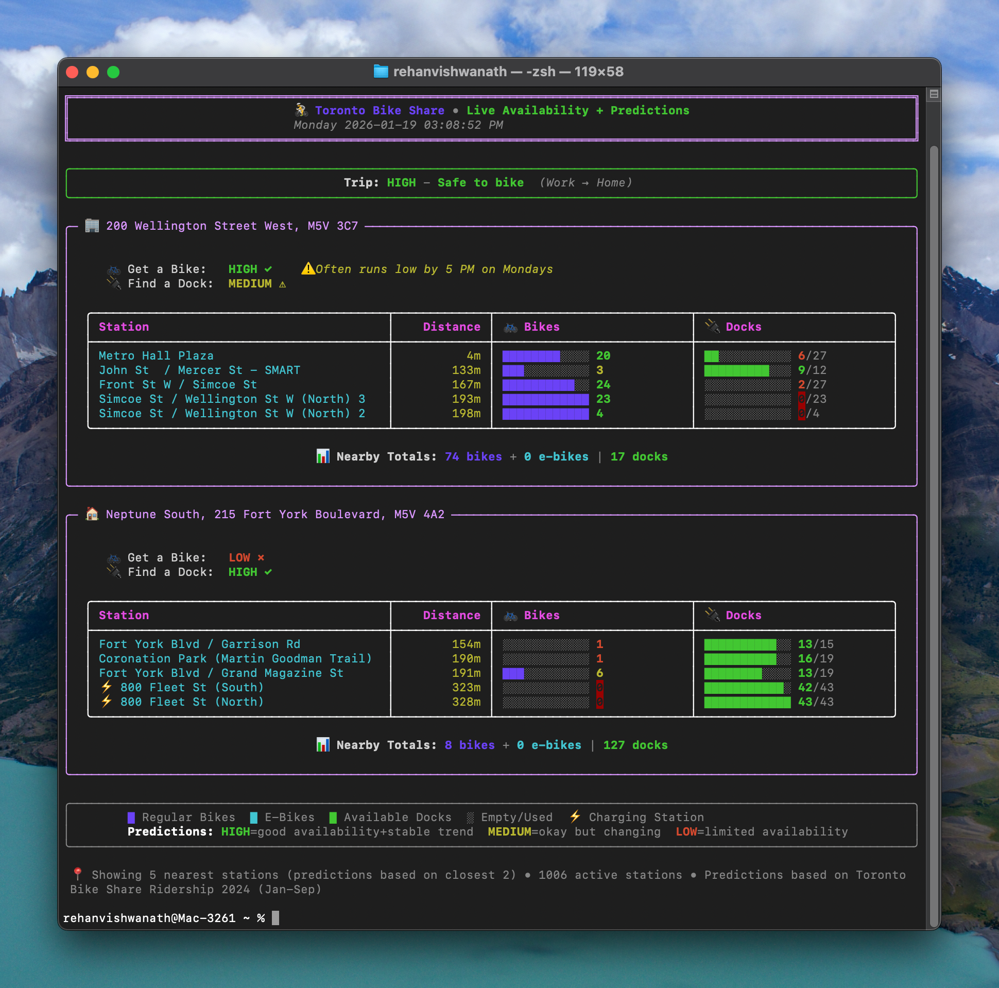
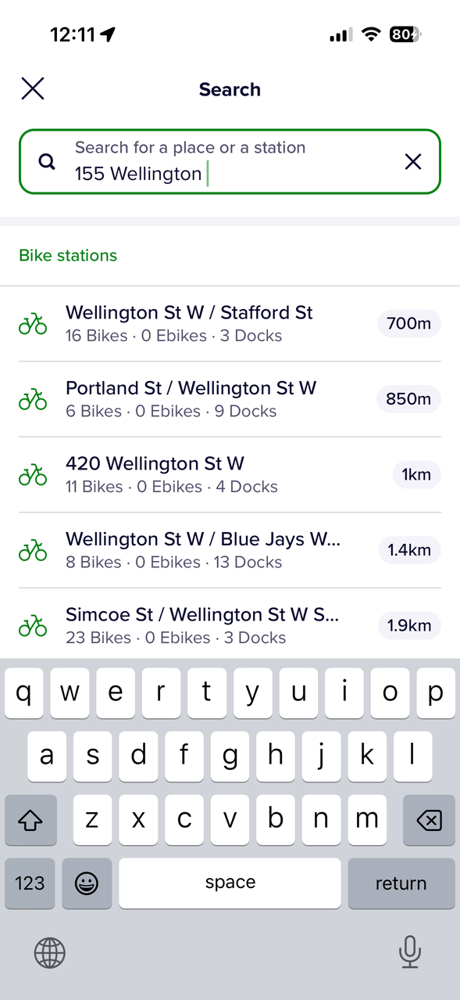
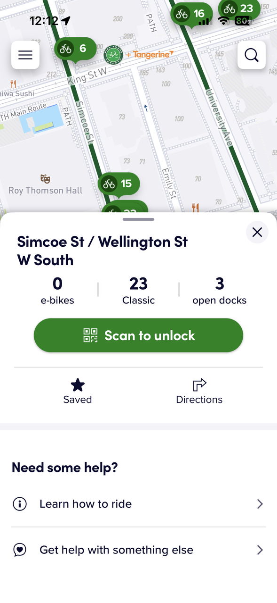

# Toronto Bike Share TUI 🚲

> **Stop tapping. Start riding.**

A zero-latency, CLI-based dashboard for Toronto Bike Share commuters. Designed to solve the "death by a thousand cuts" friction of using the official mobile app for daily commutes.



## The Problem
The official mobile app is great for tourists but painful for daily commuters.
- **Too many clicks:** 8-12 interactions just to check if you can get a bike.
- **Snapshot only:** Tells you there are 5 bikes now, but not that they usually disappear in 10 minutes.
- **No widgets:** You have to open the app, wait for the map, zoom in, and tap a pin.

## The Solution
`bikes` is a terminal command that gives you:
- **Instant Availability:** Real-time counts for your home and work locations.
- **Predictive Intelligence:** Uses historical data (5.3 million trips) to tell you if bikes are filling up or emptying out.
- **Velocity Warnings:** *"⚠️ Often runs low by 8:45am"*
- **Granular Data:** Separates E-bikes from Classic bikes instantly.

## Installation

### Prerequisites
- Python 3.8+
- Terminal with UTF-8 support (iTerm2, Terminal.app, etc.)

### Quick Start

1. Clone the repository:
   ```bash
   git clone https://github.com/yourusername/bikeshare-tui.git
   cd bikeshare-tui
   ```

2. Install dependencies:
   ```bash
   pip install -r requirements.txt
   ```

3. Run it:
   ```bash
   python3 bikes.py
   ```

### Make it a global command

To run `bikes` from anywhere:

```bash
chmod +x bikes.py
ln -s $(pwd)/bikes.py /usr/local/bin/bikes
# OR add an alias to your shell profile
alias bikes="python3 $(pwd)/bikes.py"
```

## How It Works

### 1. Real-Time Data
Fetches live JSON feeds from the GBFS (General Bikeshare Feed Specification) API:
- `station_information.json` (Location, capacity)
- `station_status.json` (Current bikes/docks)

### 2. Predictive Engine
We processed **9 months of historical ridership data (Jan-Sep 2024)** containing **5.3 million trips**.
- We calculated the **Net Flow** (Arrivals - Departures) for every station, for every hour of the week.
- This creates a "velocity" vector: Is this station gaining or losing bikes right now?

### 3. Trend-Adjusted Predictions
The "High/Medium/Low" likelihood isn't just a guess. It combines:
- **Current State:** How many bikes are there right now?
- **Historical Velocity:** How fast do they usually leave at this hour?

| Likelihood | Logic |
|------------|-------|
| **HIGH**   | Station has bikes AND historical trend is stable/increasing. |
| **MEDIUM** | Station has bikes BUT historically empties fast at this time. |
| **LOW**    | Station is empty OR critically low and trending downwards. |

## Customization

Open `bikes.py` and edit the `LOCATIONS` dictionary to add your own favorite spots:

```python
LOCATIONS = {
    "Home": {
        "lat": 43.6395,
        "lon": -79.3960,
        "emoji": "🏠"
    },
    "Office": {
        "lat": 43.6472,
        "lon": -79.3815,
        "emoji": "🏢"
    }
}
```

## License
MIT License. Data provided by Toronto Open Data.

---

# Terminal Velocity: Solving "Death by a Thousand Cuts" in the Toronto Bike Share Experience

## 1. Problem Statement
The official Toronto Bike Share mobile app (PBSC) is a generalist tool designed for tourists and casual riders, not power users or daily commuters. For a regular commuter with a fixed route (e.g., Fort York to the Financial District), the app introduces significant friction. It treats every session as a new exploration rather than a recurring habit.

The core problem is **latency of information**. In the time-critical window of a morning commute, a rider needs binary answers immediately: *Can I get a bike?* and *Can I dock it when I arrive?* The current app requires a high cognitive load—navigating maps, filtering pins, and interpreting snapshots of data—to answer these simple questions.

## 2. Objective
To build a zero-latency, "at-a-glance" dashboard for the terminal (TUI) that provides:
1.  **Immediate Availability:** Real-time bike/dock counts for specific, pre-defined locations.
2.  **Granularity:** Distinguishing between Classic Bikes, E-Bikes, and Docks without extra clicks.
3.  **Predictive Context:** Using historical data to gauge the *velocity* of availability (is the station filling up or emptying out?), rather than just a static snapshot.

## 3. Target Demographic
**The "Power Commuter."**
This user lives in the terminal. They are likely a developer or data-adjacent professional. They have a predictable route (Home ↔ Office). They value efficiency over UI polish. They do not need a map; they know where the station is. They need to know if the station is *viable*.

## 4. Understanding the Current State (The Audit)
We conducted a user journey audit of the current Toronto Bike Share app (PBSC) for a commute from **215 Fort York Blvd** to **155 Wellington St (RBC Centre)**.

### The "No Widget" Void
The most glaring omission in the current ecosystem is the lack of "glanceability."
*   **Lock Screen:** No widget available.
*   **Home Screen:** No widget available.
To get any information, the user *must* engage fully with the application.


*The blank canvas: No lock screen or home screen widgets mean every interaction starts from zero.*

### The Search & Disambiguation Friction
The search experience is designed for exact addresses, not station names or fuzzy logic.
*   **The "Wellington" Problem:** Searching "Wellington" returns results for the entire length of Wellington Street (which runs East-West across the city).
*   **Intersection Ambiguity:** To filter, the user must know the intersecting street (Simcoe). Even then, the app returns multiple pins ("Simcoe & Wellington" vs "Simcoe & Wellington South").
*   **Pin Fatigue:** The user is forced to select a pin, verify it's the right one, and favorite it to avoid repeating this search.


*Searching for "Wellington" returns a list of addresses rather than stations. Which one is the station? The user has to guess.*

### The "Tap-to-Reveal" Pattern
The map view uses clustered pins that show a total number (e.g., "10").
*   **Ambiguity:** Does "10" mean 10 bikes or 10 docks?
*   **Hidden Detail:** To see the split (0 E-bikes, 10 Classic, 8 Docks), the user must tap the pin. This adds a physical interaction for a piece of data that should be top-level.


*The map view gives a high-level overview but hides critical details. Is "10" bikes or docks? You must tap to find out.*


*Tapping reveals the split, but this is 3-4 clicks deep into the journey. Granular details like E-bike availability are buried.*

## 5. User Journey Comparison

### Journey A: The Official App (Current State)
*Goal: Check availability for morning commute.*

1.  **Unlock Phone.** (No widget available).
2.  **Locate & Tap App.**
3.  **Wait for Load.** Map renders. GPS centers.
4.  **Locate Origin.** Zoom/Pan to Fort York.
5.  **Visual Scan.** See a "10" bubble.
6.  **Tap Pin.** Reveal details: "0 E-bikes, 10 Classic, 8 Docks."
7.  **Search Destination.** Tap Search. Type "Wellington."
8.  **Disambiguate.** Realize "Wellington" is too broad. Type "Simcoe."
9.  **Select Pin.** Choose between 3 overlapping pins.
10. **Analyze.** See destination dock availability.

**Total Clicks/Interactions:** ~8-12.
**Cognitive Load:** High. (Map reading, filtering, decision making).
**Verdict:** "Death by a thousand cuts." The user is forced to learn the UI, rather than the UI serving the user.

---

### Journey B: The TUI (The Solution)
*Goal: Check availability for morning commute.*

1.  **Open Terminal.** (Cmd+Space / Hotkey).
2.  **Type Command.** `bikes`.
3.  **Read Output.**

**Total Clicks/Interactions:** 1 command.
**Cognitive Load:** Near Zero.
**Verdict:** Instant, actionable intelligence.

## 6. Key Design Decisions & Reasoning

### Why a TUI (Terminal User Interface)?
*   **Proximity to Workflow:** For the target demo, the terminal is already open.
*   **Speed:** Text renders faster than maps.
*   **Precision:** We don't need a map. We know where "Home" is. We need *numbers*.
*   **No "App Fatigue":** No context switching to a phone, no waiting for animations.

### Why Python & Rich?
*   **Rich Library:** Allows for beautiful, modern CLI formatting (tables, emojis, progress bars, colors) without the complexity of a full GUI framework.
*   **Standard Library Focus:** We used `urllib` and `json` to minimize dependencies, making the script portable and easy to install.

### The "Simple Statistics" vs. ML Decision
We considered using a Machine Learning model (XGBoost or Prophet) to predict availability but decided against it.
*   **Why Not ML:** ML models are opaque "black boxes," heavy to run, and require constant retraining.
*   **Why Simple Statistics:** Bike commuting is highly cyclical (human behavior).
    *   *The Logic:* A simple mean average of "Net Flow" (Arrivals - Departures) grouped by **Day of Week** and **Hour** captures 90% of the signal.
    *   *Interpretability:* We can explain exactly *why* a prediction is made ("Usually -5 bikes/hr at this time").

## 7. The Prediction Engine: Solving the "Snapshot" Problem
The biggest flaw in the official app is that it provides a **snapshot** (e.g., "5 bikes available"). It does not tell you that 10 minutes ago there were 15, and 10 minutes from now there will be 0.

### The Data Pipeline
1.  **Source:** Toronto Open Data (9 months of ridership history, 5.3 million trips).
2.  **ETL:** We parsed the CSVs to calculate **Net Flow** for every station, for every hour of the week.
    *   *Departure:* Demand for bikes.
    *   *Arrival:* Demand for docks.
3.  **Storage:** Aggregated data is stored in a lightweight (2MB) JSON lookup file. This allows O(1) access time—instant results without querying a database.

### The "Trend-Adjusted" Logic
We created a custom availability algorithm that combines **State + Velocity**:
*   **HIGH Likelihood:** Station has >40% capacity **AND** the historical trend is stable or increasing.
*   **MEDIUM Likelihood:** Station has bikes, **BUT** historically empties fast at this hour.
*   **LOW Likelihood:** Station is empty **OR** is critically low and trending downwards.

This logic powers the **"Depletion Warnings"** (e.g., *⚠️ Often runs low by 8:45 AM on Fridays*), giving the user a "rush factor" that the official app completely lacks.

## 8. What We Shipped
We delivered a standalone executable command `bikes` that prints a dashboard to the terminal.

### Features
*   **Dual-Location View:** Simultaneous status for Origin (Fort York) and Destination (RBC).
*   **Visual Bars:** ASCII progress bars for Bikes vs. Docks vs. E-bikes.
*   **Color Coding:** Green (Good), Yellow (Warning), Red (Critical).
*   **Prediction Context:** A "Likelihood" score and specific warning messages based on historical data.

### Visual Comparison

**The App (Conceptual):**
> [Map View] -> [Pin] -> [Popup] -> "10 Bikes"
> (Requires navigation, tapping, and mental math).

**The TUI (Actual):**
```text
╭─ 🏠 215 Fort York Blvd ──────────────────────────╮
│  🚲 Get a Bike:   MEDIUM ⚠                       │
│     (Often runs low by 8:45am on Fridays)        │
│                                                  │
│  Station          Dist   Bikes       Docks       │
│  Fort York Blvd   37m    ███░░ 15    ████░ 30    │
╰──────────────────────────────────────────────────╯
```

## 9. Conclusion & Learnings
By stripping away the map and focusing on the raw data needs of the commuter, we reduced a 12-step interaction process down to 2 seconds.

The key learning is that **context is king**. Knowing "there are 5 bikes" is useless if you don't know that "5 bikes usually disappear in 10 minutes at this time of day." By fusing real-time API data with historical open data, we created a tool that doesn't just display information—it provides *intelligence*.
