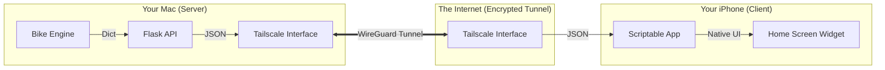

# iOS Widget Feature: The "Private Cloud" Architecture

This document details the design and implementation of the **iOS Home Screen Widget**, the final evolution of the Bike Share project. This feature transforms the tool from a local desktop utility into a distributed system accessible from anywhere.

---

## Table of Contents

1. [Problem Statement](#problem-statement)
2. [Design Goals](#design-goals)
3. [Architecture: The Private Cloud](#architecture-the-private-cloud)
4. [Technology Stack](#technology-stack)
5. [Networking Deep Dive](#networking-deep-dive)
6. [Implementation Details](#implementation-details)
7. [Learnings](#learnings)

---

## Problem Statement

The Menu Bar App solved the "at-desk" friction, but commuting starts before you sit at your computer.
> "I want to wake up, glance at my phone's lock screen, and know if I can bike."

**The Challenge:**
Our logic runs on a Mac (Python). The user is on an iPhone (iOS).
How do we get data from a computer behind a home router to a phone on 5G/LTE securely, without paying for cloud hosting?

---

## Design Goals

| Goal | Description |
|------|-------------|
| **Ubiquity** | Must work on the phone's home screen, updated automatically. |
| **Security** | No open ports on the router. No public internet exposure. |
| **Privacy** | All data processing stays on the user's hardware. |
| **Low Friction** | Minimal setup (no Apple Developer Account or Xcode required). |

---

## Architecture: The Private Cloud

We built a **Client-Server** model where you own every layer of the stack.

### The Data Flow
1.  **Client (iPhone):** The widget wakes up every 15 mins. It sends an HTTP GET request to `http://100.69.233.114:5001/status`.
2.  **Network (Tailscale):** The request enters the secure VPN tunnel on the phone and exits on the Mac.
3.  **Server (Flask):** The Python web server receives the request, validates the API Key, and calls `get_dashboard_data()`.
4.  **Logic (Engine):** The engine fetches fresh bike data, runs predictions, and returns a JSON dictionary.
5.  **Render (Scriptable):** The iPhone receives the JSON and draws the native UI (Circles, Icons, Text).

---

## Technology Stack

### 1. The Server: Flask
**Why?** Lightweight, battle-tested, standard Python.
*   We needed a way to speak "HTTP" instead of "CLI". Flask wraps our `get_dashboard_data` function in a web route (`/status`) with 5 lines of code.

### 2. The Network: Tailscale
**Why?** The "Magic" of Zero-Config Networking.
*   **Problem:** Your Mac has a local IP (`192.168.x.x`). This is invisible to the internet. To reach it from 5G, you'd usually have to open a port on your router (dangerous).
*   **Solution:** Tailscale creates a **Mesh VPN**. It assigns a stable "100.x.y.z" IP address to your Mac that *only* your authenticated devices can see. It punches through firewalls using NAT Traversal so you don't have to configure anything.

### 3. The Client: Scriptable
**Why?** "Low-Code" iOS Development.
*   **Problem:** Building a native iOS widget requires Xcode, a Mac, Swift, and a Developer Account ($99/year).
*   **Solution:** Scriptable is a free app that runs JavaScript. It provides access to iOS native widgets (`ListWidget`). We write ~50 lines of JS to fetch our API and draw the UI.

---

## Networking Deep Dive

This project relies on **Overlay Networking**.

### The IP Address: `100.69.233.114`
This is a **CGNAT IP** (Carrier Grade NAT) used by Tailscale. It is distinct from:
*   **Local IP:** `192.168.68.55` (Only works in your living room).
*   **Public IP:** `76.xx.xx.xx` (Your house's address on the internet).

Tailscale creates a virtual network adapter (`utun`) on both devices. When your phone pings `100.69.233.114`, the OS routes the traffic into the Tailscale app, which encrypts it, sends it over the internet (UDP), and decrypts it on your Mac.

### The Port: `5001`
Think of the IP address as the "Building Address," and the Port as the "Apartment Number."
*   **IP:** Finds your Mac.
*   **Port 5001:** Finds the specific *Python program* (Flask) listening for messages.
*   We avoided port 5000 because macOS AirPlay often hogs it.

---

## Implementation Details

### Security: API Keys
Even inside a VPN, it's good practice to lock the door.
*   We generated a random 16-char string: `j0viWMEnrzwEGzqWiGXU4A`
*   The Scriptable widget sends this key in the URL: `?key=...`
*   The Flask server rejects any request without it (`401 Unauthorized`).

### "Headless" Code Reuse
Because we refactored the code in Phase 3 (MVC Architecture), creating the API was trivial.
*   **CLI:** Calls `get_dashboard_data()` → formatting logic → `print()`.
*   **API:** Calls `get_dashboard_data()` → `jsonify()` → HTTP Response.

We reused 100% of the core business logic.

---

## Learnings

1.  **The "Private Cloud" is powerful.** You don't need AWS or Heroku to host an API. Your own Mac + Tailscale is a free, secure, high-performance cloud server.
2.  **Low-Code Clients enable rapid prototyping.** Scriptable allowed us to build a native-feeling iOS widget in minutes using simple JavaScript, bypassing the massive learning curve of SwiftUI.
3.  **Network Topology matters.** Understanding the difference between Local IPs, Public IPs, and VPN IPs allowed us to build a solution that works *everywhere* without compromising security.
